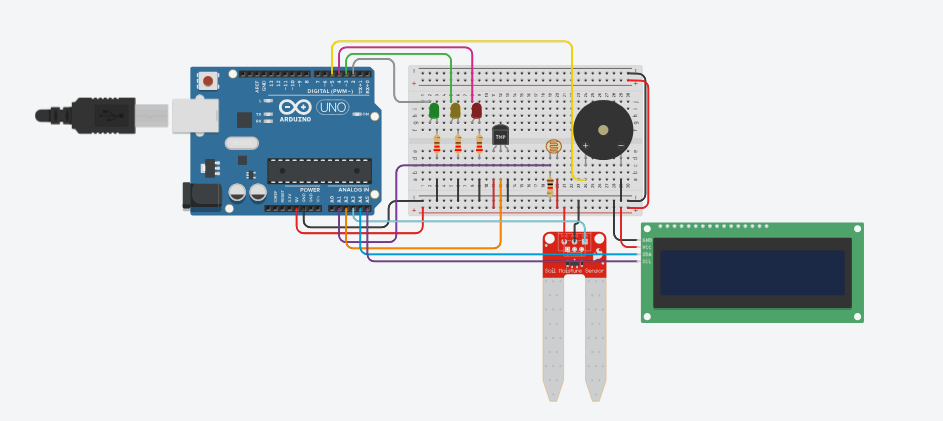

# 🌡️ Sistema de Monitoramento Ambiental com Arduino

Projeto desenvolvido com Arduino para monitoramento de luminosidade, temperatura e umidade utilizando sensores analógicos, LEDs, buzzer e display LCD I2C.

---

## 📌 Descrição

O sistema realiza leituras do ambiente e classifica os valores em diferentes níveis de alerta.

Os dados são exibidos em um display LCD 16x2 I2C e o sistema utiliza LEDs e buzzer para indicar o estado atual do ambiente:

- 🟢 Ambiente ideal → LED verde
- 🟡 Atenção → LED amarelo
- 🔴 Alerta crítico → LED vermelho + buzzer

As telas do display alternam automaticamente entre:

1. Umidade
2. Temperatura
3. Luminosidade

---

## 🛠️ Componentes Utilizados

- Arduino Uno
- Sensor LDR
- Sensor de temperatura
- Sensor de umidade
- Display LCD 16x2 I2C
- Buzzer
- LEDs
- Resistores
- Protoboard
- Jumpers

---

## ⚙️ Funcionamento

O Arduino realiza leituras analógicas dos sensores e converte os valores utilizando a função `map()`.

O sistema também utiliza vetores para calcular a média das últimas leituras, reduzindo oscilações nos sensores.

Dependendo dos valores obtidos:

- LED verde indica ambiente ideal
- LED amarelo indica atenção
- LED vermelho e buzzer indicam alerta crítico

---

## 📊 Faixas de Monitoramento

### 🌞 Luminosidade

| Condição | Valor |
|---|---|
| Ideal | < 10% |
| Média | 10% – 30% |
| Alta | > 30% |

### 🌡️ Temperatura

| Condição | Valor |
|---|---|
| Baixa | < 10°C |
| Ideal | 10°C – 16°C |
| Alta | > 16°C |

### 💧 Umidade

| Condição | Valor |
|---|---|
| Baixa | < 50% |
| Ideal | 60% – 70% |
| Alta | > 70% |

---

## 🧠 Uso da função `map()`

O projeto utiliza a função `map()` para converter valores analógicos do Arduino em porcentagens e temperaturas.

Exemplo:

```cpp
vetorLdr[indice] = map(analogRead(ldr), 0, 679, 0, 100);
```
## 📈 Cálculo de Média

Para melhorar a estabilidade das leituras, o sistema armazena os últimos 5 valores capturados pelos sensores em vetores.

Em seguida, é calculada a média dos valores:

- Temperatura
- Umidade
- Luminosidade

Esse processo reduz ruídos e oscilações nas medições.

---

## 🔌 Esquema de Ligação

- Sensor LDR conectado ao pino analógico A1
- Sensor de temperatura conectado ao pino A2
- Sensor de umidade conectado ao pino A3
- LEDs conectados aos pinos digitais 2, 3 e 4
- Buzzer conectado ao pino 5
- Display LCD I2C conectado via protocolo I2C

---

## 🧪 Código

O código completo está disponível no arquivo:

`codigo.ino`

---

## 🖼️ Circuito


   

---

## 🔗 Link do Tinkercad 
[Link do Tinkercad]([https://www.tinkercad.com/things/iHQOMPmWRzO-checkpoint-1-edge-computing-?sharecode=3En2xkqUMvYc_v6jiciqi4EynSPyQI2_bU2YAPSz6QI](https://www.tinkercad.com/things/iHQOMPmWRzO-checkpoint-1-edge-computing-?sharecode=3En2xkqUMvYc_v6jiciqi4EynSPyQI2_bU2YAPSz6QI))

--- 

## 🚀 Como executar

1. Monte o circuito conforme o esquema
2. Abra o código na IDE do Arduino
3. Instale as bibliotecas:
   - `LiquidCrystal_I2C`
   - `Wire`
4. Faça o upload do código para a placa
5. Observe as leituras e os alertas exibidos no LCD

---

## ✨ Funcionalidades

- Monitoramento ambiental em tempo real
- Exibição de dados em LCD I2C
- Alternância automática de telas
- Sistema de alerta visual e sonoro
- Conversão de valores utilizando `map()`
- Filtragem de leituras com cálculo de média

---

## 📚 Conceitos Aplicados

- Sensores analógicos
- Conversão ADC
- Função `map()`
- Vetores e médias
- Estruturas condicionais
- Controle de display LCD I2C
- Sistemas embarcados com Arduino

---

## 🎥 Vídeo de Demonstração

O vídeo demonstrando o funcionamento completo do projeto pode ser acessado abaixo:

[▶️ Clique aqui para assistir ao vídeo](LINK_DO_VIDEO)

---

## 👤 Autores

- André Victor
- Davi Dias
- David Mikael
- Gabriel Novaga
- Matheus Monteiro
